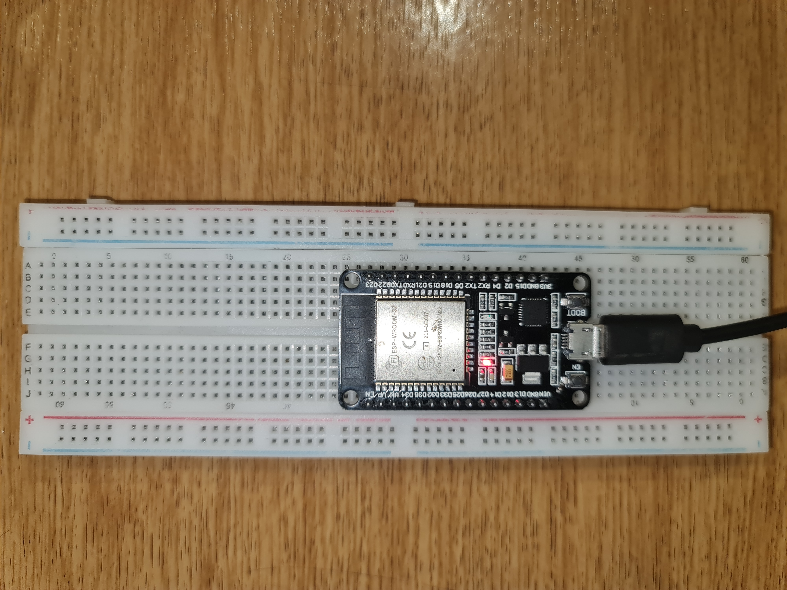

# SO2 Removal Predictor — Edge AI on ESP32

A TinyML pipeline that predicts SO2 removal efficiency in real time, running entirely on an ESP32 microcontroller. Built to bridge process engineering and embedded AI. The model is trained on experimental data, converted to TensorFlow Lite, and deployed for on-device inference. No cloud, no server round-trip.

## Why this exists

Most process-efficiency models run offline in Python, disconnected from the physical equipment they're describing. This project puts the model directly on the hardware near the process, rendering predictions instantly and locally, with no network dependency. It's a working example of taking a domain process model (chemical engineering) and making it run on $10 of hardware.

## Background

Built by a chemical engineer (PhD) with research expirience in process systems and embedded machine learning. The modeling side draws on process engineering domain knowledge — feature selection, understanding what actually drives SO2 removal — while the deployment side is standard embedded ML engineering (quantization, TFLite Micro, resource-constrained inference).

## How it works

1. A model is trained offline in TensorFlow on experimental data.
2. The trained model is converted to TensorFlow Lite and quantized for microcontroller deployment.
3. The `.tflite` model is compiled into a C array ([`so2_model.h`](so2_model.h)) and flashed to an ESP32.
4. At runtime, the ESP32 reads 4 input features, runs inference on-device using EloquentTinyML + TFLite Micro, and outputs a predicted SO2 removal efficiency over Serial.

## Model inputs

| # | Feature | Description |
|---|---------|--------------|
| 1 | Temperature | Operating temperature (°C) |
| 2 | SR | Stoichiometric ratio |
| 3 | SlurryConc | Slurry concentration |
| 4 | pH | Process pH |

**Output:** predicted % SO2 removal.

Trained on n=100 experimental data covering temperatures from 120–200°C, SR from 0.5–2.5, pH from 4–12, slurry concentration from 5–14% and SO2 removal efficiencies from roughly 48–93%.

## Performance notes

- **Inference time: ~128 microseconds** on the ESP32 — fast enough for real-time, on-device prediction with no cloud dependency.
- On a sample test case, the full-precision model predicted 76.943% SO2 removal against an actual value of 77%, while the quantized edge model predicted 75.763% on the same input. 

## Hardware requirements

- ESP32 DevKit (WROOM-32 based)
- USB cable
- Arduino IDE (tested on 1.8.19)



## Software requirements

- Arduino IDE
- [EloquentTinyML](https://github.com/eloquentarduino/EloquentTinyML/tree/2.4.0-bis)
- TensorFlowLite_ESP32 (tflm_esp32)

## Usage

1. Flash `so2_prediction.ino` to your ESP32 via Arduino IDE.
2. Open the Serial Monitor at **115200 baud**.
3. Send 4 comma-separated floats, e.g.:
   ```
   value1,value2,value3,value4
   ```
4. The predicted SO2 removal efficiency is printed to Serial.

## Implementation notes

This model uses `LeakyReLU`, which isn't a standard operator in base TensorFlow Lite Micro. It's manually registered via `AddLeakyRelu()` in the EloquentTinyML resolver. You may see a benign warning on init:

```
Calling AddBuiltin with the same op more than once is not supported (Op: #9).
```

For deployments requiring strict operator compliance (e.g. hardware certification), retrain with standard `ReLU` instead of `LeakyReLU`.

## Acknowledgements

Adapted from [Gimhan-AI's ML-ESP32S3-ArduinoIDE](https://github.com/Gimhan-AI/ML-ESP32S3-ArduinoIDE), with modifications to input structure, inference flow, and TensorFlow ops registration.

## Author

`Robert Someo Makomere`

PhD Chemical Engineer

Machine Learning • TinyML • Industrial AI • Process Optimization

rsomeo@yahoo.com

[LinkedIn](https://www.linkedin.com/in/robert-makomere-someo/)

[Google Scholar](https://scholar.google.com/citations?user=RydJ9SoAAAAJ&hl=en)

## License
This project is licensed under the MIT License. However, all personal branding, text content, and portfolio images are copyright of `Robert Someo Makomere`.
